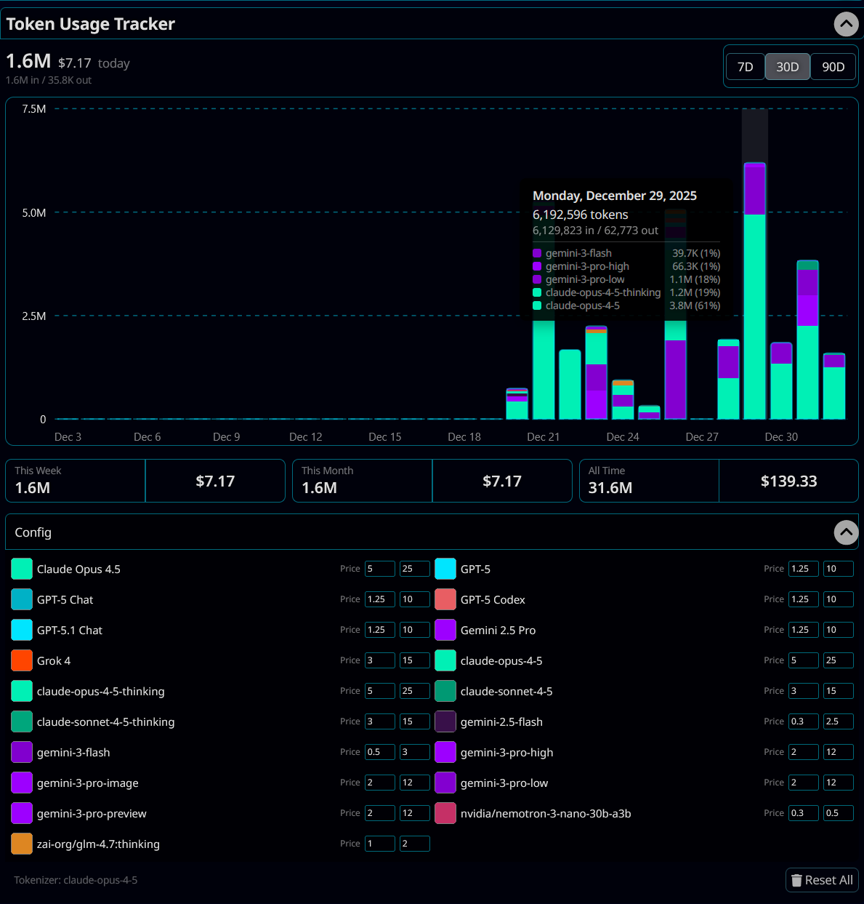

# Token Usage Tracker



A SillyTavern extension that tracks and visualizes token usage and price for your chats.

## Installation

1.  Open SillyTavern and navigate to the **Extensions** menu (blocks icon).
2.  Click on **Install Extension**.
3.  Paste the repository URL into the "Extension URL" field:
    ```
    https://github.com/Vibecoder9000/Extension-TokenUsage
    ```
4.  Click **Install for all users** or **Install just for me**.

## Usage

Once installed, the extension will automatically start tracking token usage. The GUI will be in the extensions menu.

## License

This project is licensed under the GNU Affero General Public License v3.0 (AGPL-3.0). See the `LICENSE` file for details.
